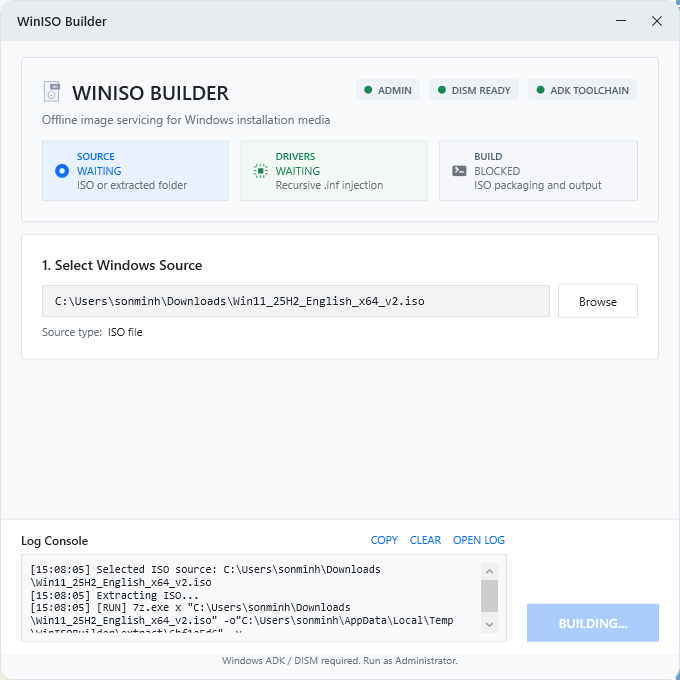
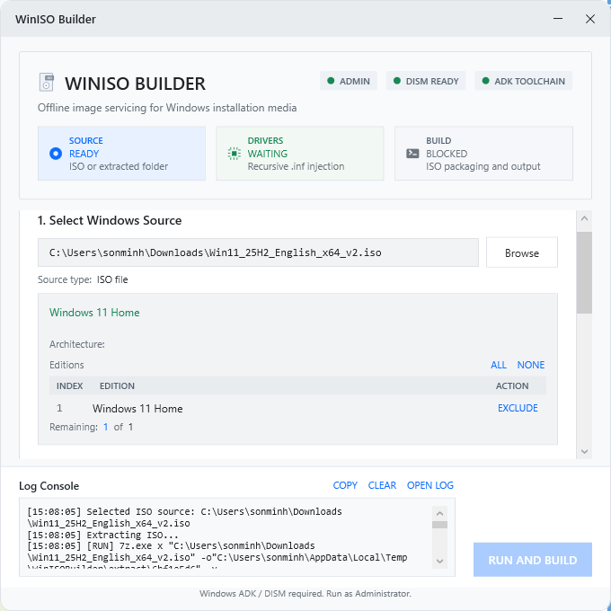
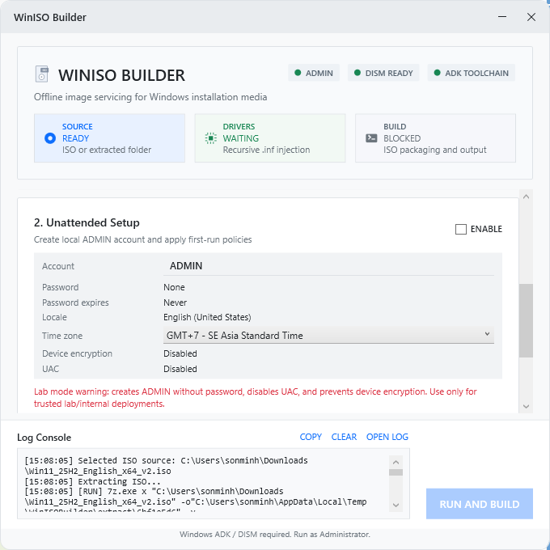
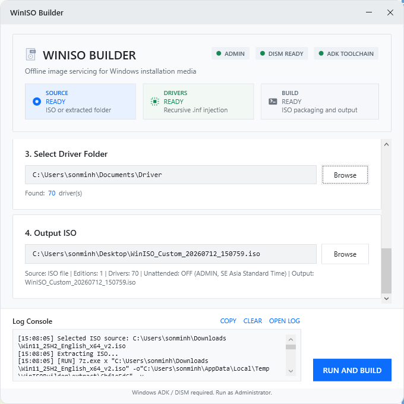
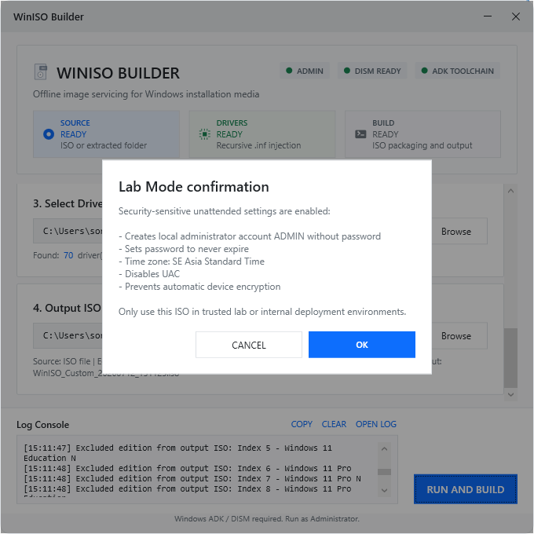

# WinISO Builder

WinISO Builder là ứng dụng WPF dùng để tạo ISO cài đặt Windows tùy biến. Ứng dụng hỗ trợ đọc ISO Windows, chọn edition cần giữ lại, inject driver `.inf` offline bằng DISM, tùy chọn tạo cấu hình unattended cho môi trường lab, và đóng gói lại ISO bootable bằng `oscdimg.exe`.

## Tính năng chính

- Chọn nguồn từ file `.iso` hoặc thư mục Windows source đã giải nén.
- Đọc danh sách edition trong `sources\install.wim` hoặc `sources\install.esd`.
- Exclude edition không cần dùng; output WIM chỉ giữ các edition được chọn.
- Tự convert/export `install.esd` sang `install.wim` trước khi servicing.
- Inject driver `.inf` vào từng edition đã chọn bằng DISM `/Add-Driver /Recurse`.
- Build lại ISO bootable BIOS/UEFI bằng Windows ADK `oscdimg.exe`.
- Lab Mode tùy chọn:
  - Tạo local administrator account.
  - Ẩn một số OOBE screen.
  - Tạo `Autounattend.xml`.
  - Tạo `SetupComplete.cmd` để áp dụng first-run policies.
- Log trực quan trong UI, bao gồm command đang chạy dạng `[RUN] ...`.
- Cleanup thư mục tạm trong `%TEMP%\WinISOBuilder` sau build, cancel, fail hoặc khi thoát app.

## Yêu cầu môi trường

- Windows 10/11 x64.
- Chạy ứng dụng bằng Administrator.
- Windows ADK Deployment Tools, cần có `oscdimg.exe`.
- DISM có sẵn trong Windows (`C:\Windows\System32\Dism.exe`).
- Khi build source code: .NET SDK 10, được pin bằng `global.json`.

> Lưu ý: bản publish `win-x64` là self-contained, người dùng cuối không cần cài riêng .NET runtime. Tuy nhiên vẫn cần Windows ADK Deployment Tools để build ISO.

## Cài nhanh bằng winget

Người dùng có thể cài nhanh môi trường cần thiết bằng PowerShell hoặc Windows Terminal:

```powershell
winget install -e --id Microsoft.WindowsADK
winget install -e --id Microsoft.DotNet.SDK.10
```

Sau khi cài Windows ADK, đảm bảo đã có `oscdimg.exe` trong Deployment Tools.

## Cài Windows ADK

Cài Windows ADK từ Microsoft, chọn tối thiểu phần Deployment Tools.

Tài liệu Microsoft:

```text
https://learn.microsoft.com/windows-hardware/get-started/adk-install
```

Đường dẫn `oscdimg.exe` thường là:

```text
C:\Program Files (x86)\Windows Kits\10\Assessment and Deployment Kit\Deployment Tools\amd64\Oscdimg\oscdimg.exe
```

## Build từ source

```powershell
dotnet restore
dotnet build WinISOBuilder.sln -c Release
```

## Publish bản production

```powershell
dotnet publish WinISOBuilder.csproj -p:PublishProfile=win-x64
```

Output:

```text
bin\Release\net10.0-windows\publish\win-x64\WinISOBuilder.exe
```

Nếu cần tạo zip release thủ công:

```powershell
New-Item -ItemType Directory -Force -Path dist | Out-Null
Compress-Archive `
  -Path bin\Release\net10.0-windows\publish\win-x64\WinISOBuilder.exe `
  -DestinationPath dist\WinISOBuilder-1.0.0-win-x64.zip `
  -CompressionLevel Optimal
```

## Cách sử dụng

1. Chạy `WinISOBuilder.exe` bằng Administrator.
2. Chọn Windows ISO hoặc thư mục Windows source đã giải nén.
3. Chọn/exclude edition cần giữ lại trong output ISO.
4. Chọn thư mục driver có chứa file `.inf`.
5. Chọn output path cho ISO mới.
6. Tùy chọn bật Lab Mode nếu cần unattended setup cho môi trường lab.
7. Bấm `RUN AND BUILD`.

## Hình ảnh giao diện

### 1. UI giao diện



### 2. Thêm file ISO



### 3. Tùy chọn Unattended Setup



### 4. Thêm driver và chọn vị trí lưu trữ



### 5. Xác nhận building



## Luồng xử lý kỹ thuật

1. Nếu input là ISO, app giải nén vào:

```text
%TEMP%\WinISOBuilder\extract\<random>
```

2. Nếu source là extracted folder, app tạo working copy trong temp trước khi sửa.
3. App tìm `sources\install.wim` hoặc `sources\install.esd`.
4. Nếu là `install.esd`, hoặc user exclude edition, app export các edition được chọn sang WIM mới bằng DISM `/Export-Image`.
5. App mount từng edition trong WIM mới, inject driver, rồi commit image.
6. Nếu Lab Mode bật, app ghi `Autounattend.xml` và `SetupComplete.cmd` vào Windows source.
7. App dùng `oscdimg.exe` để build ISO bootable.
8. App cleanup `%TEMP%\WinISOBuilder`.

## Lab Mode

Lab Mode chỉ nên dùng trong môi trường tin cậy như lab, test bench hoặc internal deployment.

Khi bật Lab Mode, app sẽ cảnh báo trước khi build. Nếu xác nhận, app sẽ:

- Tạo local administrator account theo tên đã nhập.
- Không đặt password cho account.
- Set password never expires bằng `SetupComplete.cmd`.
- Disable UAC.
- Prevent automatic device encryption.

Không nên dùng Lab Mode cho image phát hành rộng rãi hoặc môi trường không kiểm soát.

## Log và troubleshooting

Log trong UI hiển thị tiến trình và command đang chạy.

File log kỹ thuật nằm tại:

```text
%TEMP%\WinISOBuilder\logs
```

Mỗi command external tool ghi lại:

- Tool name.
- Command arguments.
- Exit code.
- STDOUT.
- STDERR.

Các lỗi thường gặp:

- `oscdimg.exe not found`: chưa cài Windows ADK Deployment Tools.
- `Elevated permissions are required`: chưa chạy app bằng Administrator.
- Driver folder không có `.inf`: app sẽ chặn build trước khi gọi DISM.
- ISO thiếu `boot\etfsboot.com` hoặc `efi\microsoft\boot\efisys.bin`: ISO source không bootable hoặc thiếu file boot.

## Test production bắt buộc

Trước khi release chính thức, nên test bằng VM:

- Windows 10 ISO x64 với `install.wim`.
- Windows 11 ISO x64 với `install.wim`.
- Windows 11 ISO x64 với `install.esd`.
- Multi-edition ISO, exclude một vài edition.
- Driver folder hợp lệ có `.inf`.
- Driver folder rỗng.
- Cancel build khi DISM đang chạy.
- Boot output ISO bằng Hyper-V Generation 1 và Generation 2.
- Lab Mode trong VM riêng.

## Cấu trúc dự án

```text
WinISOBuilder.csproj
App.xaml
MainWindow.xaml
MainWindow.xaml.cs
Styles.xaml
Models/
  IsoInfo.cs
Services/
  DismService.cs
  ProcessRunner.cs
ViewModels/
  MainViewModel.cs
Properties/
  PublishProfiles/
    win-x64.pubxml
logo/
  app.ico
```

## Ghi chú về Autounattend.xml

File `Autounattend.xml` ở root repo là sample/reference. Ứng dụng hiện tự generate `Autounattend.xml` trong `DismService.CreateAutounattendXml(...)` khi Lab Mode được bật.

Với Windows 11 26H1 Arm64, answer file cần component `processorArchitecture="arm64"` thay vì `amd64`.
