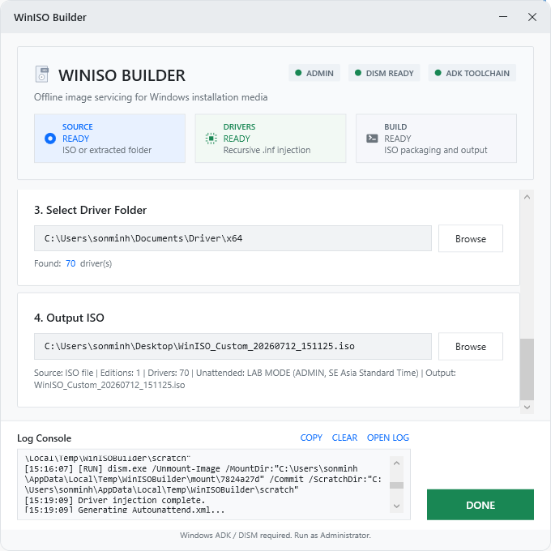

# WinISO Builder

WinISO Builder is a Windows WPF tool for creating customized Windows installation ISO files. It can read Windows ISO sources, keep selected editions, inject `.inf` drivers offline with DISM, optionally generate Lab Mode unattended setup files, and rebuild a bootable ISO with Windows ADK `oscdimg.exe`.

## Features

- Select a Windows `.iso` file or an extracted Windows source folder.
- Read editions from `sources\install.wim` or `sources\install.esd`.
- Keep only selected editions in the output image.
- Inject recursive `.inf` drivers into selected editions.
- Optional Lab Mode unattended setup for internal testing.
- Visible build log with running commands.
- Cleanup `%TEMP%\WinISOBuilder` after build, cancel, fail, or app exit.
- Build completion popup with donation QR.

## Requirements

- Windows 10/11 x64.
- Run as Administrator.
- Windows ADK Deployment Tools (`oscdimg.exe` required).
- DISM, included with Windows.
- .NET SDK 10 only if building from source.

Quick setup:

```powershell
winget install -e --id Microsoft.WindowsADK
winget install -e --id Microsoft.DotNet.SDK.10
```

Common `oscdimg.exe` path:

```text
C:\Program Files (x86)\Windows Kits\10\Assessment and Deployment Kit\Deployment Tools\amd64\Oscdimg\oscdimg.exe
```

## Build From Source

```powershell
dotnet restore
dotnet build WinISOBuilder.sln -c Release
```

## Publish

```powershell
dotnet publish WinISOBuilder.csproj -p:PublishProfile=win-x64
```

Output:

```text
bin\Release\net10.0-windows\publish\win-x64\WinISOBuilder.exe
```

## Usage

1. Run `WinISOBuilder.exe` as Administrator.
2. Select a Windows ISO or extracted source folder.
3. Select the editions to keep.
4. Select a driver folder containing `.inf` files.
5. Choose the output ISO path.
6. Enable Lab Mode only for trusted lab/internal environments.
7. Click `RUN AND BUILD`.

If the input is an ISO, the app extracts it to:

```text
%TEMP%\WinISOBuilder\extract\<random>
```

Temporary files are cleaned automatically after the build flow finishes or when the app exits.

## Screenshots

### 1. Main UI


### 2. Select ISO


### 3. Unattended Setup


### 4. Drivers and Output


### 5. Build Confirmation


### 6. Done



### 7. Donation QR


## Lab Mode Notice

Lab Mode creates a local administrator account, skips selected OOBE screens, disables UAC, prevents automatic device encryption, and writes unattended setup files. Use it only for trusted lab or internal deployment environments.

## Troubleshooting

- `oscdimg.exe not found`: install Windows ADK Deployment Tools.
- `Elevated permissions are required`: restart the app as Administrator.
- Driver folder has no `.inf`: select a valid recursive driver folder.
- Output ISO is not bootable: verify the source contains required boot files.

Technical logs are written to:

```text
%TEMP%\WinISOBuilder\logs
```

## Autounattend.xml

`Autounattend.xml` in the repository root is a sample/reference file. The app generates its own `Autounattend.xml` when Lab Mode is enabled.
